#  Java Maven Library Template 

Java library to solve tetris M2 puzzle.

## Use template

To use this template, you just need to click on "Use this template" at the top of the main page of this repository, or you can copy/paste this repository.

## Requirements

- [ ] [Create an account on Sonatype](https://issues.sonatype.org/secure/Signup!default.jspa)
- [ ] [Create a JIRA ticket on Sonatype to approve your groupId (io.github.YOUR-GITHUB-USERNAME)](https://issues.sonatype.org/secure/CreateIssue.jspa?issuetype=21&pid=10134)
- [ ] [Generate a gpg key and distribute the public key to a keyserver](https://central.sonatype.org/publish/requirements/gpg/)

## Template configurations

- [ ] **Fix pom.xml**
  - *To guide you, a FIXME tag has been added to all lines to be edited.*
- [ ] **Config SonarCloud**
  - To configure SonarCloud for your project you must go to <https://sonarcloud.io>
- [ ] **Create your GitHub secrets on your repository**
  - *NEXUS_USERNAME* with your username used on Sonatype
  - *NEXUS_PASSWORD* with your password used on Sonatype
  - *GPG_PRIVATE_KEY* with the private key of your generated pgp key
    - to get the private key `gpg --armor --export-secret-key <key-id> > privkey.asc`
  - *GPG_PASSPHRASE* with the passphrase of your gpg key
- [ ] **Activate the JavaDoc GitHub page**
  - To enable the JavaDoc GitHub Page, you need to enable the GitHub page in your repository settings for the *javadoc* branch.

## Diagram

```mermaid

classDiagram
    class TetrisSolver{
      +solve(PuzzlePiece firstPuzzlePieces)$ HashMap<Integer, >
      -solve(HashSet~Solution~ backTrack,  int board, int nbUsePz1, int nbUsePz2, int nbUsePz3, int nbUsePz4, int nbUsePz5, int nbUsePz6)$
    }

    class Board{
      +toString(int board)$ String
      +canPutPuzzlePieceOnBoard(int board, int puzzlePiecePlacement)$ bool
    }
    Board ..> PuzzlePiece
    Board ..> CoordinateCalculator

    class CoordinateCalculator{
      +getColomnIndex(int listIndex)$ int
      +getRowIndex(int listIndex)$ int
      +getListIndex(int rowIndex, int colomnIndex)$ int
    }

    class PuzzlePiece{
      <<enumeration>>
      STICK
      SQUARE
      L
      INVERSED_L
      MINI_SQUARE
      Z

      +getShape() int
      +getAllPossiblePlacementInTheBoard() int[]
    }
    PuzzlePiece <|-- PuzzlePieceInterface
    PuzzlePiece --> PuzzlePieceInterface

    class PuzzlePieceInterface{
      <<interface>>
      +getShape() int
      +getAllPossiblePlacementOnTheBoard() int[]
    }

    class Stick{
      +getShape() int
      +getAllPossiblePlacementOnTheBoard() int[]
    }
    Stick <|-- PuzzlePieceInterface

    class Square{
      +getShape() int
      +getAllPossiblePlacementOnTheBoard() int[]
    }
    Square <|-- PuzzlePieceInterface

    class L{
      +getShape() int
      +getAllPossiblePlacementOnTheBoard() int[]
    }
    L <|-- PuzzlePieceInterface

    class Inversed_L{
      +getShape() int
      +getAllPossiblePlacementOnTheBoard() int[]
    }
    Inversed_L <|-- PuzzlePieceInterface

    class Mini_Square{
      +getShape() int
      +getAllPossiblePlacementOnTheBoard() int[]
    }
    Mini_Square <|-- PuzzlePieceInterface

    class Z{
      +getShape() int
      +getAllPossiblePlacementOnTheBoard() int[]
    }
    Z <|-- PuzzlePieceInterface

```

